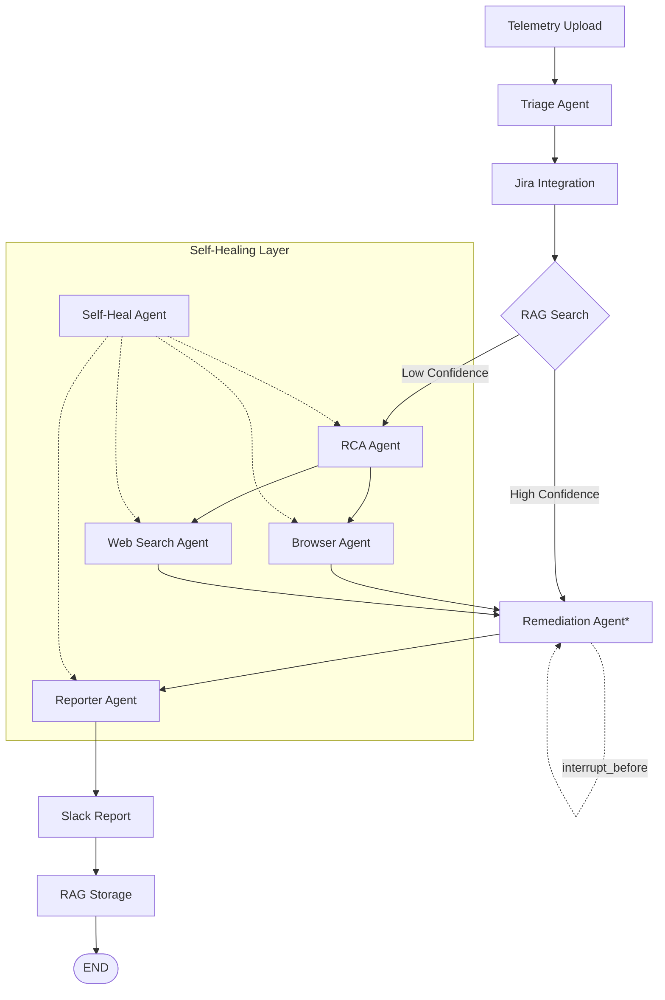

# System Architecture & Workflow

This document provides a detailed look into how AegisOps operates, the roles of various agents, and the flow of data through the system.

## 🏗️ Architectural Overview

The system is built on a **Stateful Agent Swarm** architecture using **LangGraph**. Unlike traditional linear pipelines, this allows for dynamic routing, retries, and self-healing.

### Key Components

-   **Backend (Python/FastAPI)**: Serves as the orchestration layer and API provider.
-   **Agent Swarm (LangGraph)**: The core intelligence that handles the investigation.
-   **Frontend (React/Vite)**: A real-time dashboard for monitoring the investigation and approving actions.
-   **Vector Database (RAG)**: Stores historical incidents to provide "instant-on" root cause analysis for recurring issues.

---

## 🔄 Detailed Node-by-Node Workflow

The system is a stateful directed acyclic graph (DAG) where each node represents a specialized agent or processing step.

### 1. Triage Agent (`triage`)
-   **Purpose**: Initial log and metric analysis.
-   **Input**: `raw_logs`, `raw_metrics`.
-   **Logic**:
    -   Truncates logs to the most recent 50 entries.
    -   Extracts structured events (timestamp, service, level, message).
    -   Identifies the **suspected vendor** and **severity** level (Sev1–Sev4).
-   **Tools**: `post_slack_notification` (sends a "New Incident Triaged" alert).
-   **Output**: `suspected_vendor`, `severity`, `internal_findings`, `events`.

### 2. Jira Integration (`jira`)
-   **Purpose**: Create an incident ticket immediately after triage.
-   **Input**: `incident_id`, `severity`, `suspected_vendor`, `internal_findings`.
-   **Logic**:
    -   Calls Jira REST API v3 to create an Incident-type ticket with severity mapped to priority.
    -   Skips silently if `JIRA_BASE_URL` / `JIRA_EMAIL` / `JIRA_API_TOKEN` are not set.
    -   Returns `jira_ticket_id` and `jira_ticket_url` which are carried through all subsequent nodes.
-   **Output**: `jira_ticket_id`, `jira_ticket_url`.

### 3. RAG Cache Lookup (`rag_search`)
-   **Purpose**: Historical memory retrieval.
-   **Input**: `internal_findings`, `suspected_vendor`.
-   **Logic**: Searches ChromaDB/JSON files for past incidents with similar symptoms.
-   **Decision Point**:
    -   **Confidence ≥ 0.85**: Jump directly to `remediation` (it's a known issue).
    -   **Confidence < 0.85**: Proceed to `rca` for deeper investigation.
-   **Output**: `rag_result`, `rag_confidence`.

### 4. Root Cause Analyzer (`rca`)
-   **Purpose**: Investigation strategy and hypothesis generation.
-   **Input**: Triage findings + RAG results.
-   **Logic**:
    -   Formulates multiple **hypotheses** (e.g., "Vendor API Outage", "Network Latency").
    -   Determines routing: `needs_browser` (for status pages), `needs_web_search` (for social/news), or `needs_human_escalation`.
-   **Output**: `hypotheses`, `confidence_score`, `needs_browser`, `needs_web_search`.

### 5. Browser Scraper Agent (`browser`)
-   **Purpose**: Official vendor status verification.
-   **Input**: `suspected_vendor`.
-   **Logic**:
    -   Uses **Stagehand/Playwright** to navigate to the vendor's status page.
    -   Extracts specific outage details (affected services, current status).
-   **Tools**: `check_vendor_status_page`.
-   **Output**: `browser_result`, updated `root_cause`.

### 6. Web Search Agent (`web_search`)
-   **Purpose**: External community/news verification.
-   **Input**: `suspected_vendor`, `internal_findings`.
-   **Logic**: Queries search engines for independent confirmation from sources like DownDetector or Twitter.
-   **Tools**: `search_vendor_outage_online` (Tavily/DuckDuckGo).
-   **Output**: `web_search_result`, updated `root_cause`.

### 7. Remediation Agent (`remediation`)
-   **Purpose**: Mitigation planning and execution.
-   **Input**: Confirmed `root_cause` and investigation findings.
-   **Logic**:
    -   **Human-in-the-Loop**: Pauses here for manual approval via the UI or Slack buttons before executing.
    -   Generates a list of **remediation_steps** and a **containment plan**.
    -   Drafts long-term **recommendations**.
-   **Tools**: `post_slack_notification` (sends "Remediation Action Planned").
-   **Output**: `remediation_steps`, `recommendations`.

### 8. Reporter Agent (`reporter`)
-   **Purpose**: Postmortem documentation.
-   **Input**: Full state (findings, RCA, remediation).
-   **Logic**: Synthesizes all data into a professional Markdown report following industry standards (summary, timeline, impact, RCA, resolution).
-   **Output**: `final_report`.

### 9. Slack Report (`slack_report`)
-   **Purpose**: Deliver the final report and close out integrations.
-   **Input**: `slack_approval_ts`, `jira_ticket_id`, `final_report`.
-   **Logic**:
    -   Posts `final_report` as a threaded reply to the original Slack approval message.
    -   Transitions the Jira ticket to **Done** and appends the report as a comment.
    -   Non-blocking: failures are logged but never stop the pipeline.
-   **Tools**: `post_report_thread`, `update_jira_status`, `add_jira_comment`.
-   **Output**: No state changes (pass-through).

### 10. Self-Heal Agent (`self_heal`)
-   **Purpose**: Resilience and error recovery.
-   **Input**: `failed_node`, `last_error`.
-   **Logic**:
    -   Intercepts failures (e.g., scraping timeouts or LLM rate limits).
    -   Implements **retry logic** (up to 3 attempts).
    -   **Reroutes** around failures (e.g., if scraping fails, try web search; if both fail, escalate to human).
-   **Output**: Updated routing flags, incremented `retry_count`.

### 11. RAG Storage (`store_incident`)
-   **Purpose**: System learning.
-   **Input**: Resolved incident details.
-   **Logic**: Appends the current incident's findings and resolution to the vector database for future use.
-   **Output**: Updated knowledge base.

---

## 🏃 Step-by-Step Example: Stripe API Outage

To help you visualize the flow, here is how the system handles a typical Stripe outage:

1.  **Triage**: Logs show `StripeConnectionError` and `timeout` in the checkout service. The Triage Agent identifies **Stripe** as the suspected vendor and sets **Severity: Sev1**. A Slack alert is sent.
2.  **Jira**: A Jira ticket (e.g., `OPS-42`) is created immediately with severity, vendor, and findings. The ticket URL is carried through the rest of the pipeline.
3.  **RAG**: The system checks if this happened before. If a similar Stripe timeout was resolved yesterday, it suggests the same fix. If not, it moves on.
4.  **RCA**: The RCA agent sees "Stripe" and "Connection Timeout". It sets `needs_browser = true` to check `status.stripe.com`.
5.  **Browser**: The Browser Agent navigates to Stripe's status page. It finds a "Major Outage" notification affecting "API Requests" in the US.
6.  **Web Search**: Simultaneously, the Web Search Agent finds 10+ tweets from the last 5 minutes complaining about Stripe being down.
7.  **Remediation**: The pipeline pauses for human approval (via UI or Slack Approve/Reject buttons). Once approved, the system proposes switching the payment gateway to the backup (e.g., Adyen or PayPal).
8.  **Reporter**: A full Markdown report is generated with the Stripe status page screenshot link and a timeline of the failure.
9.  **Slack Report**: The final report is posted as a thread reply to the original Slack approval message. The Jira ticket (`OPS-42`) is transitioned to **Done** with the report appended as a comment.
10. **Storage**: The details are saved so next time a Stripe timeout occurs, the AegisOps RAG node can catch it instantly.

---

## 📊 Data Flow Diagram

